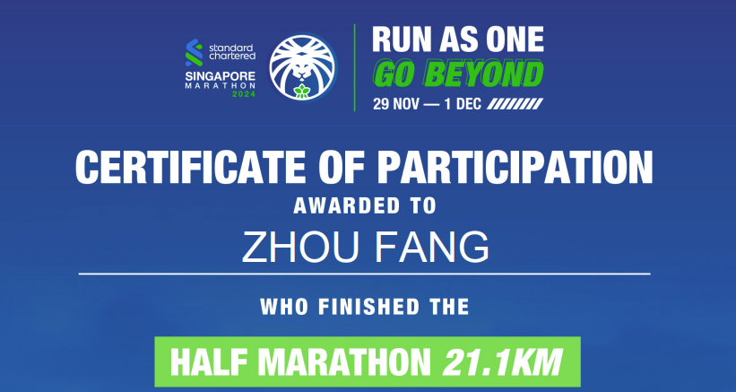

### Hi there 👋
My name is Zhou FANG.
- 😄 I'm a 2nd year PhD student in National University of NUS | @MathEXLab
- 🌱 I’m currently working on AI4Dynamics (AI4Weather&Climate) 
- ⚡ News
  - 1/Dec/2024 I'm a half-marathon finisher!
  - 

<!--
**ZhousLab/ZhousLab** is a ✨ _special_ ✨ repository because its `README.md` (this file) appears on your GitHub profile.

Here are some ideas to get you started:

- 🔭 I’m currently working on ...
- 🌱 I’m currently learning ...
- 👯 I’m looking to collaborate on ...
- 🤔 I’m looking for help with ...
- 💬 Ask me about ...
- 📫 How to reach me: ...
- 😄 Pronouns: ...
- ⚡ Fun fact: ...
-->
